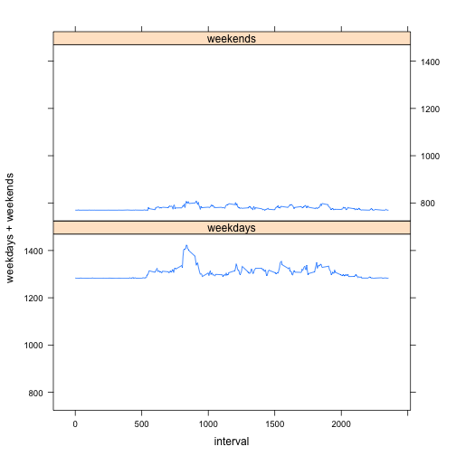

## Loading and preprocessing the data

```r
a<-read.csv("activity.csv")
a$date=as.Date(a$date)
b<-a$date
c<-a$steps
d<-a$interval
avgstepsday=aggregate(c~b, FUN=sum)
```
## What is mean total number of steps taken per day?

```r
#histogram & stats
hist(avgstepsday$c)
```

 

```r
mean(avgstepsday$c)
```

```
## [1] 10766.19
```

```r
median(avgstepsday$c)
```

```
## [1] 10765
```
## What is the average daily activity pattern?


```r
#plot
avgstepsdayn=aggregate(c~d, FUN=mean)
plot(avgstepsdayn$d,avgstepsdayn$c, type="l")
```

 
## Imputing missing values


```r
#Number of NA's, only one that has NA's is steps.
sum(is.na(a$steps))
```

```
## [1] 2304
```

## Are there differences in activity patterns between weekdays and weekends?

```r
#Replacing: 
f<-a
library(Hmisc)
f$steps<-impute(f$steps,fun=median(f$date))
c1<-f$steps
b1<-f$date
avgstepsday2=aggregate(c1~b1, FUN=sum)
c1<-as.numeric(c1)
```


```r
#descriptive stats again!
hist(avgstepsday2$c1)
```

 

```r
mean(avgstepsday2$c1)
```

```
## [1] 600235.8
```

```r
median(avgstepsday2$c1)
```

```
## [1] 11458
```


```r
#creating weekdays and weekends and plotting it
library(lubridate)
f$e<-wday(f$date)
n=nrow(f)
f$g=rep(0,n)
#dividing weekdays and weekends

for (i in 1:n){
if(f$e[i]>2)f$g[i]<-1

}
f$stepswd=f$steps*f$g
f$h=-(f$g-1)
f$stepswe=f$steps*f$h
wd=aggregate(f$stepswd~f$interval, FUN=mean)
we=aggregate(f$stepswe~f$interval, FUN=mean)
tw<-merge(wd,we,by="f$interval")
names(tw)<-c("interval","weekdays", "weekends" )
xyplot(weekdays+weekends~interval, data=tw, layout=c(1,2), type="l", outer=TRUE)
```

 
